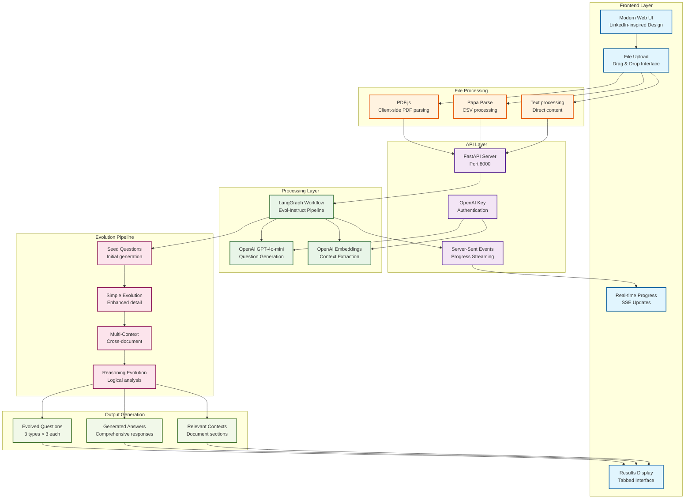

# Evol-Instruct Synthetic Data Generation App

<p align="center">
  
  
  
  
</p>

## 🚀 Overview

A sophisticated synthetic data generation application built with **Evol-Instruct methodology** from the WizardLM paper. This app uses LangGraph to orchestrate complex AI workflows that generate high-quality question-answer pairs through multiple evolution types.

### ✨ Key Features

- **🎯 Evol-Instruct Pipeline**: Advanced synthetic data generation using LangGraph
- **🌐 Modern Web Interface**: LinkedIn-inspired, professional UI with real-time progress
- **📁 Multi-File Support**: Upload and process `.txt`, `.pdf`, and `.csv` files
- **🔑 OpenAI Integration**: User-configurable API keys with secure storage
- **📊 Real-Time Progress**: Server-Sent Events (SSE) for live progress updates
- **📚 Comprehensive API**: Full REST API with interactive documentation
- **⚡ FastAPI Backend**: High-performance async API server
- **🎨 Responsive Design**: Works seamlessly on desktop and mobile

## 🏗️ Architecture

### System Architecture


*Clean, organized view of the Evol-Instruct synthetic data generation pipeline showing data flow from frontend to output generation*



### Evolution Types

1. **Simple Evolution** 🎯
   - Enhances questions with more detail and complexity
   - Maintains core meaning while adding sophistication

2. **Multi-Context Evolution** 🔗
   - Creates questions spanning multiple documents
   - Enables comprehensive cross-document analysis

3. **Reasoning Evolution** 🧠
   - Generates questions requiring logical reasoning
   - Promotes analytical thinking and problem-solving

### Tech Stack

- **Backend**: FastAPI + Uvicorn + LangGraph + LangChain
- **Frontend**: Modern HTML/CSS/JavaScript with Font Awesome
- **AI**: OpenAI GPT-4o-mini for question generation
- **File Processing**: PDF.js + Papa Parse for client-side parsing
- **Deployment**: Vercel-ready configuration

## 🚀 Quick Start

### Prerequisites

- Python 3.8+
- OpenAI API key (optional - server has default key)

### Installation

1. **Clone the repository**
   ```bash
   git clone <your-repo-url>
   cd s07-bonus-evol-instruct-app
   ```