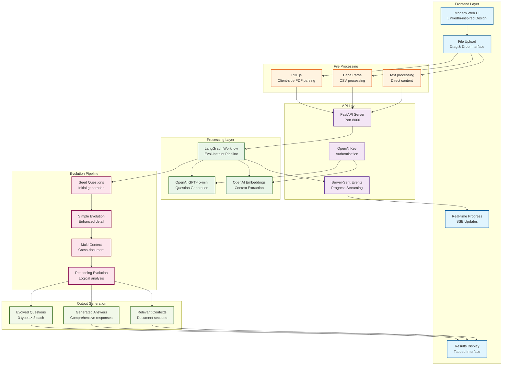

# Evol-Instruct Synthetic Data Generation App

<p align="center">
  
  
  
  
</p>

## 🚀 Overview

A sophisticated synthetic data generation application built with **Evol-Instruct methodology** from the WizardLM paper. This app uses LangGraph to orchestrate complex AI workflows that generate high-quality question-answer pairs through multiple evolution types.

### ✨ Key Features

- **🎯 Evol-Instruct Pipeline**: Advanced synthetic data generation using LangGraph
- **🌐 Modern Web Interface**: LinkedIn-inspired, professional UI with real-time progress
- **📁 Multi-File Support**: Upload and process `.txt`, `.pdf`, and `.csv` files
- **🔑 OpenAI Integration**: User-configurable API keys with secure storage
- **📊 Real-Time Progress**: Server-Sent Events (SSE) for live progress updates
- **📚 Comprehensive API**: Full REST API with interactive documentation
- **⚡ FastAPI Backend**: High-performance async API server
- **🎨 Responsive Design**: Works seamlessly on desktop and mobile

## ��️ Architecture

### System Architecture



### Evolution Types

1. **Simple Evolution** 🎯
   - Enhances questions with more detail and complexity
   - Maintains core meaning while adding sophistication

2. **Multi-Context Evolution** 🔗
   - Creates questions spanning multiple documents
   - Enables comprehensive cross-document analysis

3. **Reasoning Evolution** 🧠
   - Generates questions requiring logical reasoning
   - Promotes analytical thinking and problem-solving

### Tech Stack

- **Backend**: FastAPI + Uvicorn + LangGraph + LangChain
- **Frontend**: Modern HTML/CSS/JavaScript with Font Awesome
- **AI**: OpenAI GPT-4o-mini for question generation
- **File Processing**: PDF.js + Papa Parse for client-side parsing
- **Deployment**: Vercel-ready configuration

## 🚀 Quick Start

### Prerequisites

- Python 3.8+
- OpenAI API key (optional - server has default key)

### Installation

1. **Clone the repository**
   ```bash
   git clone <your-repo-url>
   cd s07-bonus-evol-instruct-app
   ```

2. **Create virtual environment**
   ```bash
   python3 -m venv venv
   source venv/bin/activate  # On Windows: venv\Scripts\activate
   ```

3. **Install dependencies**
   ```bash
   pip install -r requirements.txt
   ```

4. **Start the server**
   ```bash
   python3 -c "from api.main import app; import uvicorn; uvicorn.run(app, host='0.0.0.0', port=8000)"
   ```

5. **Open your browser**
   ```
   http://localhost:8000
   ```

## 📖 Usage

### Web Interface

1. **Upload Documents** (up to 10 files)
   - Supported formats: `.txt`, `.pdf`, `.csv`
   - Max file size: 2MB each
   - Drag & drop or click to select

2. **Configure Settings**
   - Set target question count (3-15)
   - Add your OpenAI API key (optional)

3. **Generate Questions**
   - Click "Generate Questions" or "Try Demo"
   - Watch real-time progress updates
   - View results organized by evolution type

### API Usage

#### Health Check
```bash
curl http://localhost:8000/health
```

#### Generate Questions
```bash
curl -X POST "http://localhost:8000/generate" \
  -H "Content-Type: application/json" \
  -H "x-openai-api-key: your-key" \
  -d '{
    "documents": [
      {
        "page_content": "Your document content...",
        "metadata": {
          "source": "document.txt",
          "size": 1024,
          "type": "text/plain",
          "extension": "txt"
        }
      }
    ],
    "target_questions": 9
  }'
```

#### Demo Generation
```bash
curl -X POST "http://localhost:8000/generate-demo"
```

## 📚 API Documentation

Visit `http://localhost:8000/docs` for comprehensive API documentation including:
- All endpoints with request/response examples
- Authentication guide
- Error handling
- Best practices
- Usage examples

## 🔧 Configuration

### Environment Variables

- `OPENAI_API_KEY`: Your OpenAI API key (optional - server has default)

### Upload Limits

- **Maximum files**: 10 documents
- **File size**: 2MB per file
- **Supported formats**: `.txt`, `.pdf`, `.csv`

## 🎯 Features in Detail

### Real-Time Progress Tracking
- Server-Sent Events (SSE) for live updates
- Visual progress indicators
- Step-by-step evolution tracking
- Error handling with user feedback

### Multi-File Processing
- **Text files**: Direct content extraction
- **PDF files**: Client-side parsing with PDF.js
- **CSV files**: Structured data extraction with Papa Parse
- **File management**: Upload, preview, and remove documents

### OpenAI Integration
- **User keys**: Secure localStorage storage
- **Server fallback**: Default API key for demo
- **Key validation**: Format checking and error handling
- **Privacy**: Keys never sent unless explicitly provided

### Modern UI/UX
- **Responsive design**: Works on all devices
- **Professional styling**: LinkedIn-inspired interface
- **Interactive elements**: Hover effects and animations
- **Accessibility**: Proper contrast and keyboard navigation

## 🚀 Deployment

### Vercel Deployment

The app is configured for Vercel deployment:

1. **Connect repository** to Vercel
2. **Set environment variables**:
   - `OPENAI_API_KEY`: Your OpenAI API key
3. **Deploy**: Automatic deployment on push to main

### Local Development

```bash
# Development server with auto-reload
uvicorn api.main:app --reload --host 0.0.0.0 --port 8000

# Production server
uvicorn api.main:app --host 0.0.0.0 --port 8000
```

## 🧪 Testing

### API Testing
```bash
# Test health endpoint
curl http://localhost:8000/health

# Test demo generation
curl -X POST http://localhost:8000/generate-demo

# Test with custom documents
curl -X POST http://localhost:8000/generate \
  -H "Content-Type: application/json" \
  -d '{"documents": [...], "target_questions": 9}'
```

### Frontend Testing
1. Open `http://localhost:8000`
2. Upload test documents
3. Generate questions
4. Verify real-time progress
5. Check all evolution types

## 📁 Project Structure

```
s07-bonus-evol-instruct-app/
├── api/                    # Backend API
│   ├── __init__.py
│   ├── main.py            # FastAPI application
│   ├── models.py          # Pydantic models
│   └── evol_graph.py      # LangGraph workflow
├── static/                # Frontend assets
│   ├── index.html         # Main application
│   ├── styles.css         # Modern styling
│   └── script.js          # Interactive logic
├── data/                  # Sample documents
├── requirements.txt       # Python dependencies
├── vercel.json           # Deployment config
└── README.md             # This file
```

## 🔬 Technical Details

### LangGraph Workflow

The Evol-Instruct pipeline consists of:

1. **Document Processing**: Extract and prepare content
2. **Seed Generation**: Create initial questions
3. **Simple Evolution**: Enhance with detail and complexity
4. **Multi-Context Evolution**: Cross-document analysis
5. **Reasoning Evolution**: Logical reasoning questions
6. **Answer Generation**: Create comprehensive answers
7. **Context Extraction**: Identify relevant document sections

### Real-Time Progress

- **SSE Implementation**: Server-Sent Events for live updates
- **Progress Types**: `phase_start`, `step`, `success`, `error`, `complete`
- **Visual Feedback**: Color-coded progress indicators
- **Error Handling**: Graceful failure with user notifications

### File Processing

- **Client-side parsing**: Reduces server load
- **Multiple formats**: Unified processing pipeline
- **Error handling**: Graceful failure for unsupported files
- **Size limits**: Prevents memory issues

## 🤝 Contributing

1. Fork the repository
2. Create a feature branch
3. Make your changes
4. Add tests if applicable
5. Submit a pull request

## 📄 License

This project is licensed under the MIT License - see the LICENSE file for details.

## 🙏 Acknowledgments

- **Evol-Instruct Methodology**: Based on the [WizardLM paper](https://arxiv.org/pdf/2304.12244)
- **LangGraph**: For the powerful workflow orchestration
- **FastAPI**: For the high-performance API framework
- **OpenAI**: For the advanced language models

## 📞 Support

For questions or issues:
1. Check the API documentation at `/docs`
2. Review the code comments
3. Open an issue on GitHub

---

**Built with ❤️ using Evol-Instruct methodology and modern web technologies**
