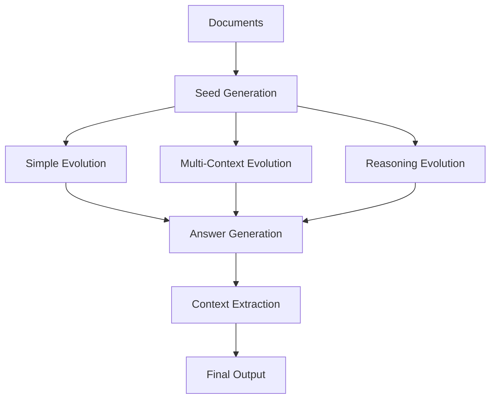

# 🧠 Evol-Instruct API

A FastAPI-based implementation of the **Evol-Instruct methodology** from the WizardLM paper, using **LangGraph** for agent-based synthetic data generation. This API generates evolved questions, answers, and contexts from your documents using three sophisticated evolution strategies.

## 🌟 Features

### **Three Evolution Types**
- **🔧 Simple Evolution**: Adds constraints, deepens analysis, increases complexity
- **🔗 Multi-Context Evolution**: Creates questions requiring multiple documents
- **🧠 Reasoning Evolution**: Generates logical inference and cause-effect questions

### **Complete Output Format**
- ✅ **Evolved Questions** with IDs and evolution types
- ✅ **Generated Answers** based on document context
- ✅ **Relevant Contexts** extracted from source documents

### **Production Ready**
- 🚀 **FastAPI** with automatic documentation
- 🌐 **CORS** enabled for web integration
- 📊 **Structured logging** and error handling
- 🔄 **Health checks** and status monitoring

## 🏗️ Architecture



## 🚀 Quick Start

### **1. Local Development**

```bash
# Clone and setup
git clone <your-repo>
cd evol-instruct-api

# Install dependencies
pip install -r requirements.txt

# Set environment variable
export OPENAI_API_KEY="your-openai-api-key"

# Run locally
uvicorn api.main:app --reload --host 0.0.0.0 --port 8000
```

Visit `http://localhost:8000/docs` for interactive API documentation!

### **2. Deploy to Vercel**

```bash
# Install Vercel CLI
npm install -g vercel

# Deploy
vercel

# Set environment variable in Vercel dashboard
# OPENAI_API_KEY = "your-openai-api-key"
```

## 📡 API Endpoints

### **Main Generation Endpoint**

```bash
POST /generate
```

**Request Body:**
```json
{
  "documents": [
    {
      "page_content": "Your document content here...",
      "metadata": {"source": "doc1.pdf", "page": 1}
    }
  ],
  "target_questions": 9
}
```

**Response:**
```json
{
  "evolved_questions": [
    {
      "id": "simple_0",
      "question": "What are the specific eligibility requirements...",
      "evolution_type": "simple",
      "parent_id": "seed_0"
    }
  ],
  "question_answers": [
    {
      "question_id": "simple_0",
      "answer": "The eligibility requirements include..."
    }
  ],
  "question_contexts": [
    {
      "question_id": "simple_0", 
      "contexts": ["Relevant document excerpts..."]
    }
  ],
  "processing_time": 15.3,
  "total_questions": 9
}
```

### **Demo Endpoint**

```bash
POST /generate-demo
```

Try the API immediately with pre-loaded student loan documents!

### **Utility Endpoints**

- `GET /` - API information
- `GET /health` - Health check
- `GET /status` - Detailed status
- `GET /evolution-types` - Evolution methodology info
- `GET /debug/sample-request` - Sample request format

## 🔬 Evolution Methodology

Based on the [WizardLM paper](https://arxiv.org/pdf/2304.12244), our implementation includes:

### **Simple Evolution Operations**
- **Add Constraints**: "Additionally, consider specific limitations..."
- **Deepen**: "Provide comprehensive analysis of..."
- **Concretize**: Replace abstract concepts with specific examples
- **Reasoning Steps**: "First analyze X, then consider Y..."
- **Real-world Context**: Add practical application scenarios

### **Multi-Context Evolution**
- Identifies related documents using semantic analysis
- Creates comparative questions across documents
- Synthesizes information from 2-4 sources
- Generates cross-referential analysis questions

### **Reasoning Evolution**
- **Conditional Logic**: "If X occurs, what are implications for Y?"
- **Cause-Effect**: "What consequences would result from..."
- **Strategic Thinking**: "Given constraints A and B, recommend..."
- **Inference**: Questions requiring logical deduction

## 🔧 Technical Implementation

### **LangGraph Workflow**
- **State Management**: Tracks documents, questions, and evolution progress
- **Node-based Processing**: Each evolution type as separate node
- **Error Handling**: Graceful failure recovery and logging
- **Async Processing**: Non-blocking execution for better performance

### **Key Components**
- **Document Processing**: Chunking and initial question generation
- **Evolution Router**: Distributes processing across evolution types
- **Quality Filter**: Validates question clarity and answerability
- **Context Extraction**: Maps questions to relevant document sections

## 📊 Example Usage

### **Python Client**

```python
import requests

# Custom documents
response = requests.post("https://your-api.vercel.app/generate", json={
    "documents": [
        {
            "page_content": "Your document content...",
            "metadata": {"source": "doc1.pdf"}
        }
    ],
    "target_questions": 9
})

result = response.json()
print(f"Generated {result['total_questions']} questions in {result['processing_time']:.1f}s")
```

### **cURL**

```bash
# Demo endpoint
curl -X POST "https://your-api.vercel.app/generate-demo"

# Custom documents
curl -X POST "https://your-api.vercel.app/generate" \
  -H "Content-Type: application/json" \
  -d '{
    "documents": [
      {
        "page_content": "Your content here...",
        "metadata": {"source": "test.pdf"}
      }
    ],
    "target_questions": 9
  }'
```

## ⚡ Performance

- **Processing Time**: ~15-30 seconds for 9 questions
- **Scalability**: Handles 1-5 documents efficiently
- **Resource Usage**: Optimized for Vercel serverless limits
- **Error Recovery**: Graceful handling of API failures

## 🛠️ Configuration

### **Environment Variables**
```bash
OPENAI_API_KEY="your-openai-api-key"  # Required
```

### **Request Limits**
- **Documents**: 1-5 documents per request
- **Target Questions**: 3-15 questions (3 per evolution type)
- **Document Size**: ~2000 characters per document for optimal performance

## 🔍 Monitoring & Debugging

### **Logging**
- Detailed request/response logging
- Evolution step tracking
- Error categorization and reporting

### **Health Checks**
```bash
GET /health      # Simple health check
GET /status      # Detailed system status
```

### **Error Handling**
- Input validation with clear error messages
- Graceful degradation on API failures
- Comprehensive error logging for debugging

## 🚀 Deployment Options

### **Vercel (Recommended)**
- Zero configuration deployment
- Automatic scaling
- Built-in monitoring

### **Other Platforms**
- **Railway**: `railway deploy`
- **Render**: Connect GitHub repository
- **AWS Lambda**: Use Mangum adapter
- **Docker**: `docker build -t evol-instruct .`

## 📝 Development

### **Project Structure**
```
evol-instruct-api/
├── api/
│   ├── __init__.py
│   ├── main.py          # FastAPI application
│   ├── models.py        # Pydantic models
│   └── evol_graph.py    # LangGraph implementation
├── requirements.txt
├── vercel.json
└── README.md
```

### **Running Tests**
```bash
# Install test dependencies
pip install pytest httpx

# Run tests
pytest
```

## 🤝 Contributing

1. Fork the repository
2. Create your feature branch (`git checkout -b feature/AmazingFeature`)
3. Commit changes (`git commit -m 'Add AmazingFeature'`)
4. Push to branch (`git push origin feature/AmazingFeature`)
5. Open a Pull Request

## 📄 License

This project is licensed under the MIT License - see the [LICENSE](LICENSE) file for details.

## 🔗 References

- **WizardLM Paper**: [Evol-Instruct Methodology](https://arxiv.org/pdf/2304.12244)
- **LangGraph**: [Agent Framework Documentation](https://python.langchain.com/docs/langgraph)
- **FastAPI**: [Modern API Framework](https://fastapi.tiangolo.com/)

---

**🌟 Star this repository if you find it helpful!** 