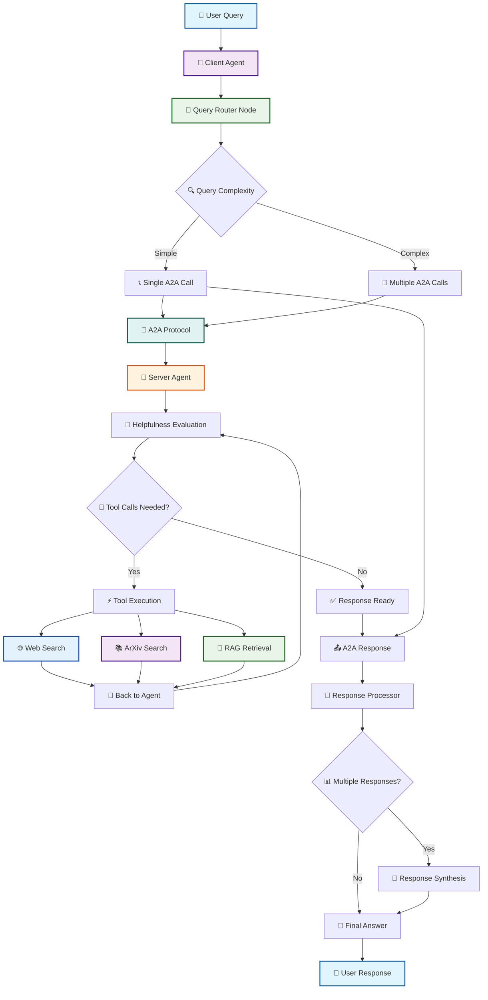
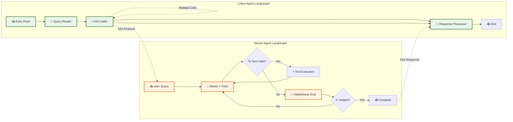

# A2A Client Agent

This directory contains the **Client Agent** implementation for Activity #1, demonstrating A2A (Agent-to-Agent) communication with the existing server agent.

## 🏗️ Architecture

### System Overview
```
┌─────────────────┐    A2A Protocol    ┌─────────────────┐
│   Client Agent  │ ───────────────→   │   Server Agent  │
│   (New)         │                    │   (Existing)    │
│                 │                    │                 │
│ - Query Router  │                    │ - Web Search    │
│ - A2A Caller    │                    │ - ArXiv Search  │
│ - Response      │                    │ - RAG Search    │
│   Processor     │                    │ - Helpfulness  │
└─────────────────┘                    └─────────────────┘
```

### Detailed Flow Architecture



### LangGraph Node Architecture



## 📁 Files

- **`client_tools.py`**: A2A protocol tools for communicating with server
- **`client_agent.py`**: LangGraph-based client agent implementation  
- **`client_test.py`**: Comprehensive test suite and demonstration
- **`CLIENT_README.md`**: This documentation

## 🚀 Quick Start

### 1. Start the Server Agent
```bash
# In one terminal, start the server
python -m app
```

### 2. Run the Client Test
```bash
# In another terminal, run the comprehensive demo
python -m app.client_test

# Or run in interactive mode
python -m app.client_test interactive
```

### 3. Use the Client Agent in Code
```python
from app.client_agent import ClientAgent

# Create client agent
client = ClientAgent()

# Send a query via A2A protocol
response = await client.query("What are the latest AI developments?")
print(response)
```

## 🎯 Key Features

### ✨ Intelligent Query Routing
- **Single Call**: Simple queries forwarded directly
- **Multi Call**: Complex queries split into multiple server calls
- **Smart Detection**: Automatically detects query complexity

### 🔄 A2A Protocol Implementation
- **Standards Compliant**: Uses proper A2A message format
- **Context Management**: Maintains conversation context
- **Error Handling**: Graceful degradation on failures

### 🧠 Response Synthesis
- **Multi-Response Combining**: Intelligently merges multiple server responses
- **Context Preservation**: Maintains conversation flow
- **User-Friendly Formatting**: Clean, readable output

## 📊 Test Scenarios

The `client_test.py` includes comprehensive demonstrations:

1. **Server Connection Test**: Verify server accessibility
2. **Capabilities Discovery**: Query server's AgentCard
3. **Simple Query**: Basic single-call interaction
4. **Multi-Part Query**: Complex queries requiring multiple calls
5. **Specialized Queries**: Testing different server capabilities
6. **Conversation Context**: Multi-turn conversation flow

## 🔧 Configuration

### Default Settings
- **Server URL**: `http://localhost:8000`
- **Max Calls**: 3 per query
- **Timeout**: 60 seconds per call

### Customization
```python
# Custom configuration
client = ClientAgent(
    server_url="http://your-server:8000",
    max_calls=5
)
```

## 🌟 Example Interactions

### Simple Query
```python
query = "What are the latest developments in AI?"
# Client → Server → Web Search → Response
```

### Multi-Step Research  
```python
query = "Compare recent AI research with market trends"
# Client splits into:
# 1. Academic research call (ArXiv)
# 2. Market trends call (Web search)  
# 3. Synthesis of both responses
```

### Conversation Flow
```python
# Turn 1: "What is machine learning?"
# Turn 2: "How does it relate to AI?" (with context)
# Turn 3: "Give me practical applications" (with context)
```

## 🎓 Learning Objectives

This implementation demonstrates:

- **A2A Protocol Usage**: How agents communicate using standards
- **LangGraph Architecture**: Building complex agent workflows  
- **Agent Collaboration**: Multiple agents working together
- **Context Management**: Maintaining state across interactions
- **Error Handling**: Robust failure management
- **Response Synthesis**: Combining multiple agent outputs

## 🔍 Troubleshooting

### Server Not Accessible
```bash
# Check if server is running
curl http://localhost:8000/a2a/card

# Start server if needed
python -m app
```

### Import Errors
```bash
# Ensure you're in the project root
cd /path/to/15_A2A_LangGraph

# Run with proper module path
python -m app.client_test
```

### Timeout Issues
- Increase timeout in `client_tools.py`
- Check server responsiveness
- Verify network connectivity

## 🎉 Success Criteria

- ✅ Client discovers server capabilities
- ✅ Client sends queries via A2A protocol  
- ✅ Client handles server responses
- ✅ Client maintains multi-turn conversations
- ✅ Client demonstrates agent-to-agent collaboration

This client agent showcases the power of A2A protocols for enabling sophisticated agent-to-agent communication and collaboration!
